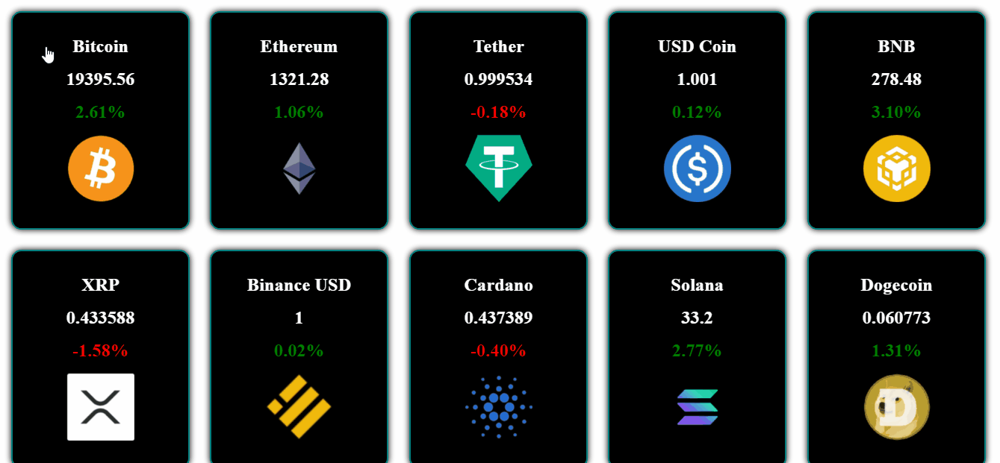

<h1 align="center">
   
  
    
</h1>

Cards gerados dinamicamente através de informações fornecidas por api coingecko.

<i>"Seja bem-vindo"</i>

 

Este projeto foi desenvolvido a fim de estudo, pra análise de manipulação de dados apresentados dinamicamente através do JavaScript. para efeito dos cards utilizei da biblioteca vanilla-tilt-js.

  <kbd>
    
  </kbd>
  &nbsp;&nbsp;&nbsp;&nbsp;
  <kbd> 
    
  </kbd>
  &nbsp;&nbsp;&nbsp;&nbsp;

  

## **`Tecnologias utilizadas`**
- HTML
- CSS
- JavaScript
  

<h1 align="center">
   
  
    
</h1>

Made with 💙 by Gustavo Mattos 👋 [See my LinkedIn](linkedin.com/in/guh-mattos/)

